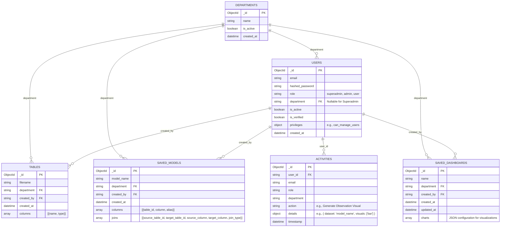

# BI Platform MongoDB ERD

This Entity Relationship Diagram (ERD) illustrates the NoSQL collections and their logical relationships in the MongoDB database. 

> [!NOTE]
> Unlike traditional SQL databases, MongoDB uses ObjectIds to link collections logically rather than strictly enforcing foreign key constraints. The `department` string is used heavily across collections to ensure Data Siloing at the query level.
